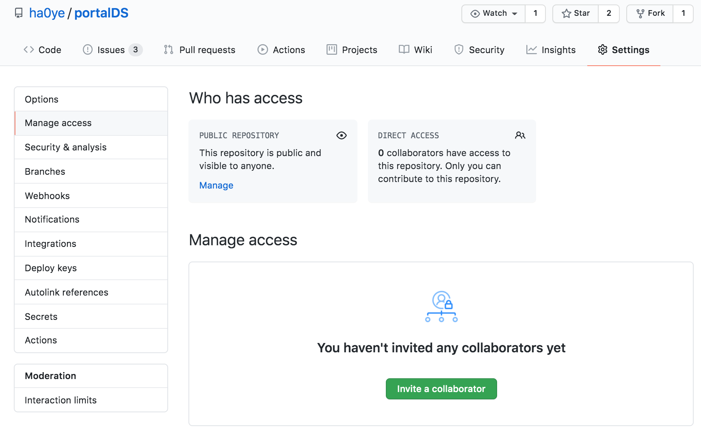
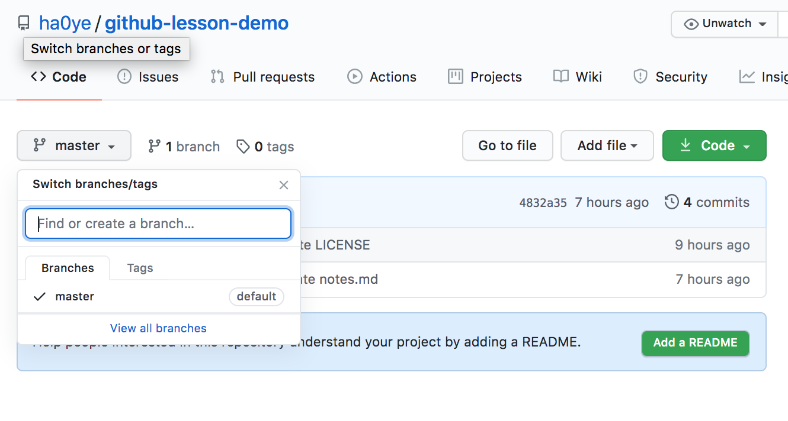
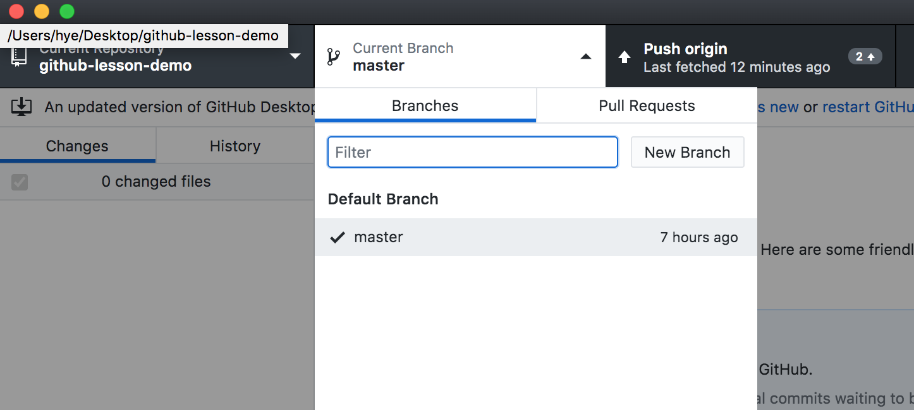

# Syllabus
  Gabriele Hayden
  Data Services, University of Oregon Libraries
  
  Forked and lightly modified from syllabus and materials by Hao Ye, Health Science Center Libraries, University of Florida
  (updated: 2020-11-26)

## Intro
* Motivations
  * One of the advantages for using version control is managing collaborative work.
  * Git is a flexible tool that accommodates many different styles of collaboration... not all of these styles are suitable for small research teams.
  * "GitHub flow" is a workflow that is lightweight and scales well for individuals and small teams.
* Learning Outcomes
  * describe how merge conflicts originate and how to resolve them
  * apply the "GitHub flow" workflow for collaborating
  * create and navigate branches on GitHub and using GitHub Desktop
  * create and merge pull requests
  * understand "forks" and open-source-community development on GitHub
* Prerequisites
  This lesson assumes you:
  * have some familiarity making *repos* and *commits*
  * know how to synchronize repos from your computer to GitHub

## Merge Conflicts

* Inviting Collaborators
  * I have a github repo, and would like to give my collaborator access to work on the project.
  * From the github repo page:
    - `Settings` -> `Manage access`
    - `Invite a collaborator`
  
* A Simple Workflow
  Two people, A and B, are working together on one repo in GitHub:
  * A makes commits, A pushes the new commits to GitHub.
  * B pulls the latest commits from A, works on new commits, and pushes their new commits back to GitHub.
  * A pulls the latest commits from B, works on new commits, etc.
* What happens if you forget to pull?
  You get a warning when you try to push to GitHub.
  
* Merging
  * a `git merge` combine the changes from diverging commits:
    - suppose A and B start with commit: `{orig}`
    - A makes a commit, `{a}`, with changes
    - B makes a commit, `{b}`, with changes
    - `git merge` combines `{a}` and `{b}` into a new commit `{c}`, that contains both sets of changes.
* Merging (automatically)
  * if the changes are in different files
    OR different parts of the same files
    - git is generally able to combine the changes without further intervention
  * if git is unable to merge automatically, then it is a `merge conflict`
* Resolving merge conflicts
  * when git cannot combine the changes automatically, you must manually create the merged file:
  
* Resolving merge conflicts 2
  * After the conflicts are resolved, you need to create a new commit with the merged edits.
  * This merged commit can then be pushed to github without issue.
  * For non-text files, you may need to revert back to one or the other version (whichever is correct)
* Summary
  * This approach works pretty well when there is one primary contributor, and collaborators rarely make changes.
    - otherwise everyone needs to be constantly pulling and merging, contacting each other through separate channels to let them know you are done pushing changes to GitHub, etc.

## GitHub Flow

* Essentials of GitHub Flow
  Manage work using branches - `merge` branches back to the primary branch when ready.
  
* Steps
  1. Create a branch and switch to it.
  2. Add commits with desired changes.
  3. Open a pull request (PR).
  4. Review the PR if necessary, and merge.
  5. Delete branch if done.

## Navigating Branches

* What is a Branch?
  * A `branch` is a label for a set of commits.
  
  img: https://www.atlassian.com/git/tutorials/using-branches
* How do branches work?
  * By default, you are in the primary branch.
    - each commit has changes from the previous commit
    - a linear sequence of versions of the project
  * When you want to make changes and commits without disrupting the primary branch:
    - create a new branch
    - merge when ready
* Creating new branches (GitHub)
  
* DEMO
* Creating new branches (GitHub Desktop)
  
* DEMO

## Merging Branches

* Merging (branches)
  * Nearly the same as merging commits:
    - merge the last commit on another branch to the current branch.
  1. switch to the branch that will keep the merged result
  2. merge from the other branch
* DEMO (GitHub Desktop)
* Pull Request (GitHub)
  * recommended practice for merges on GitHub
  * lets you document the merge
    - can request official "review"
    - other collaborators can comment, make further changes
* DEMO (GitHub)

## Community-oriented Development on GitHub

* Issues
  * reported bugs, feature requests, etc.
  * anyone can contribute to discussion
  * can be referred to by number in commits and pull requests
* DEMO
* Forks
  * How do you contribute to other people's projects?
    - Fork = clone a repo on GitHub
    - Forks retain memory of original repo (and cannot have their own issues)
    - Pull Requests can merge from across forks.
  * "Fork and PR" is a common phrase indicating how one should contribute to an open-source project.
## Thanks

* Let me know what content you'd like to see
* Contact me for additional questions or consultation requests!
* Check back in on the libguide for more modules and contact info:
  - https://guides.uflib.ufl.edu/reproducibility
